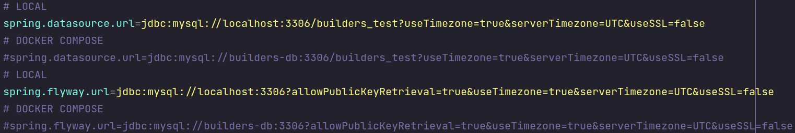

# Builders Test 🧪

> Project developed in test for Platform Builders

[](https://github.com/jlenon7?tab=followers)
[](https://github.com/jlenon7/builders-test/stargazers/)

<p>
  

  

  
</p>

`RESTFul API` using `Spring Boot`


## ENDPOINTS

> All endpoints are well documented within the [InsomniaCollection.json](https://github.com/jlenon7/builders-test/blob/master/.github/InsomniaCollection.json) file
> and in [Swagger](http://localhost:8085/api/swagger-ui.html)

| METHOD    | URI                    | NAME               |
| --------- | ---------------------  | -----------------  |
| GET       | api/v1/clients         | clients.index      |
| POST      | api/v1/clients         | clients.store      |
| GET       | api/v1/clients/:id     | clients.show       |
| PUT       | api/v1/clients/:id     | clients.update     |
| DELETE    | api/v1/clients/:id     | clients.delete     |

### Query search in clients.index

Pagination: `?page=0&limit=10`

Between ages: `?since_age=20&max_age=40`

### Content Negotiation

> All endpoints of this API has content negotiation between, xml, json and yaml.

Send `Content-Type: application/xml` Receives `Accept: application/json`

Send `Content-Type: application/json` Receives `Accept: application/xml`

Send `Content-Type: application/xml` Receives `Accept: application/x-yaml`

Send `Content-Type: application/x-yaml` Receives `Accept: application/json`

etc...

---

## Running project local

> First run an instance of MySQL, you can use this command to run with docker.

```bash
docker run --name mysql -p 3306:3306 -e MYSQL_ROOT_PASSWORD=bancodedados -e MYSQL_PASSWORD=bancodedados -e MYSQL_DATABASE=mysql -d mysql
```

> Then build the project and run the tests using Maven

```bash
mvn clean package
```

> Then run the .jar file created by Maven

```bash
java -jar target/builders-test-0.1-SNAPSHOT.jar
```

---

## Running project with docker-compose

> First change the url of the database inside application.properties to builders-db instead of localhost

<p align="center">
    
</p>

> Then run the project using docker-compose

```bash
docker-compose up -d --build
```

---

Made with 🖤 by [jlenon7](https://github.com/jlenon7) :wave:
